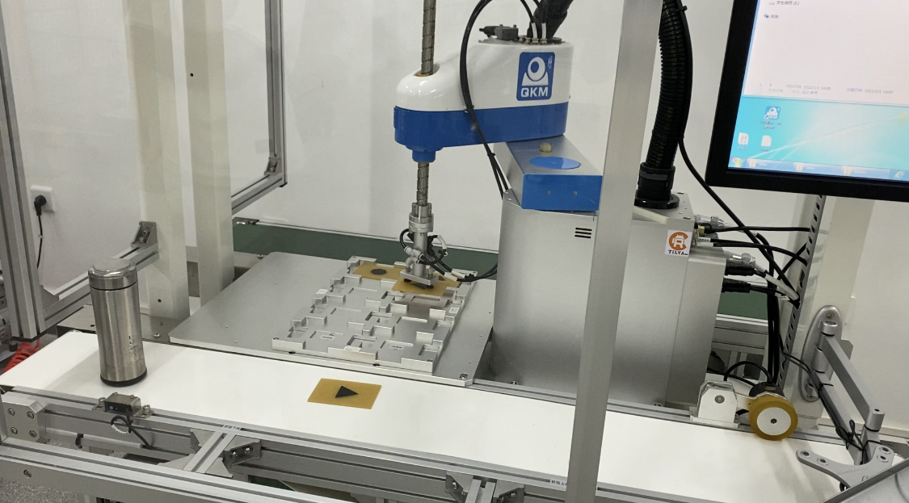

# Robotics_in_HIT
Robotics homework in Harbin Institute of Techonology SZ

## File

| File                   | Description                                                                            |
| ---------------------- | -------------------------------------------------------------------------------------- |
| SCARA/Srcbotconfig.cpp | The source code about foward and inverse kinematic of SCARA robot                      |
| SCARA/MotionPlan.cpp   | The source code about Motion Plan based on Linear Function with Parabolic Blends(LFPB) |
| SCARA/FtpControl.cpp   | The source code to control SCARA                                                       |
| Homework8              | The matlab code for motion paln based on LFPB and Cubic polynomial trajectory          |